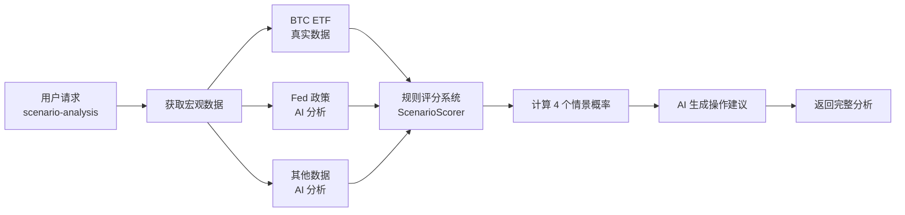

# BTC ETF 数据集成 - 完整文档

## ✅ 已完成的工作

### 1. **BTC ETF 数据爬虫** (`btc_etf_scraper.py`)
- ✅ 从 [Farside Investors](https://farside.co.uk/bitcoin-etf-flow-all-data/) 获取真实 ETF 流入流出数据
- ✅ 使用 `cloudscraper` 绕过 Cloudflare 反爬虫保护
- ✅ 自动处理 Excel 风格的负数格式 `(10.5)` → `-10.5`
- ✅ 支持导出 JSON 格式数据
- ✅ 包含 IBIT (BlackRock)、FBTC (Fidelity) 等主流 ETF 资金流向

### 2. **辅助函数模块** (`btc_etf_flow_helper.py`)
- ✅ 提供简化接口 `get_btc_etf_flow_summary()`
- ✅ 自动计算每日和每周汇总
- ✅ 返回中文描述，例如：`"单日流入 $211.4M; 近5日小幅波动"`
- ✅ 静默模式运行，不干扰主程序输出

### 3. **集成到主 API** (`main.py`)
- ✅ 在 `/api/scenario-analysis` 接口中使用真实 ETF 数据
- ✅ 替换了原来基于新闻 AI 分析的方式
- ✅ 添加了备用方案，如果爬虫失败会降级到新闻分析
- ✅ 实时获取最新 5 天的 ETF 流入流出数据

---

## 📦 依赖安装

```bash
pip3 install cloudscraper lxml pandas requests
```

---

## 🚀 使用方法

### 方法 1: 单独运行爬虫

```bash
cd /Users/user/tradingAssistant/tradingAssistant/backend
python3 btc_etf_scraper.py
```

**输出示例:**
```
============================================================
Bitcoin ETF Flow Data Scraper
============================================================
Fetching data from https://farside.co.uk/bitcoin-etf-flow-all-data/...
Using cloudscraper to bypass anti-bot protection...
✓ Successfully fetched data with cloudscraper (Status: 200)
Parsing HTML tables...
✓ Found table with 515 rows and 13 columns
Cleaning data...
✓ Cleaned 514 rows of data

============================================================
LAST 5 DAYS OF DATA:
============================================================
      Date    IBIT    FBTC   BITB   ARKB  BTCO  EZBC  BRRR   HODL  BTCW     GBTC    BTC   Total
2024-12-30     0.0    78.6   13.9  109.6   0.0   0.0   0.0    5.0   0.0      0.0    4.3   211.4
2024-12-29    -7.9     5.7    0.0   -6.8   0.0   0.0   0.0   -5.1   0.0     -5.2    0.0   -19.3
2024-12-26  -192.6   -74.4    0.0   -9.0   0.0   0.0   0.0    0.0   0.0      0.0    0.1  -275.9
2024-12-24   -91.4   -17.2  -36.1  -23.4   0.0   0.0  -2.8   -1.5   0.0     -2.9    0.0  -175.3
2024-12-23  -157.3   -15.3   -4.7   -4.7   0.0   0.0   0.0   -4.6   0.0     -2.0    0.0  -188.6
```

数据保存到: `btc_etf_flows.json`

---

### 方法 2: 测试辅助函数

```bash
python3 btc_etf_flow_helper.py
```

**输出示例:**
```
BTC ETF Flow Summary: 单日流入 $211.4M; 近5日小幅波动
```

---

### 方法 3: 在主 API 中使用

1. **启动 API 服务器:**
```bash
cd /Users/user/tradingAssistant/tradingAssistant/backend
uvicorn main:app --reload --port 8000
```

2. **测试情景分析接口:**
```bash
python3 test_etf_integration.py
```

或使用 `curl`:
```bash
curl -X POST "http://localhost:8000/api/scenario-analysis" \
  -H "Content-Type: application/json" \
  -d '{"symbol": "BTC/USDT"}'
```

**API 响应示例:**
```json
{
  "macro_data": {
    "美元指数 (DXY)": "98.5 (估算), 走弱",
    "Fed 利率政策": "维持现状",
    "BTC ETF 净流入": "单日流入 $211.4M; 近5日小幅波动",  // ← 真实数据
    "长期持有者行为": "...",
    "挖矿生产成本": "$94,000",
    "美股表现 (S&P500)": "...",
    "风险事件": "..."
  },
  "scenario_probabilities": {
    "情景 1: V型反转": {
      "probability": "35.2%",
      ...
    },
    ...
  },
  "most_likely_scenario": {...},
  "ai_analysis": {...}
}
```

---

## 📊 数据来源

| 数据项 | 来源 | 更新频率 |
|--------|------|----------|
| **BTC ETF 流入流出** | [Farside Investors](https://farside.co.uk/bitcoin-etf-flow-all-data/) | 每个交易日 |
| Fed 利率政策 | Google News + AI 分析 | 实时 |
| 长期持有者行为 | Google News + AI 分析 | 实时 |
| 美股表现 | Google News + AI 分析 | 实时 |
| 风险事件 | Google News + AI 分析 | 实时 |

---

## 🎯 情景分析系统工作流程



---

## 🔧 故障排除

### 问题 1: `ImportError: lxml not found`
**解决方案:**
```bash
pip3 install lxml
```

### 问题 2: `403 Forbidden`
**解决方案:**
```bash
pip3 install cloudscraper
```

### 问题 3: 数据解析错误
**可能原因:** Farside 网站结构变化
**解决方案:** 检查 `btc_etf_scraper.py` 中的表格解析逻辑

---

## 📈 下一步优化建议

1. **缓存机制**: 添加本地缓存，避免频繁爬取
2. **定时任务**: 使用 `cron` 或 `schedule` 库定时更新数据
3. **数据库存储**: 将历史数据存入 SQLite/PostgreSQL
4. **更多数据源**:
   - Glassnode API (链上数据)
   - CoinGlass API (持仓、清算数据)
   - FRED API (宏观经济数据)

---

## 📝 代码结构

```
tradingAssistant/backend/
├── btc_etf_scraper.py         # 爬虫主程序
├── btc_etf_flow_helper.py     # 简化接口
├── scenario_scoring.py         # 情景评分系统
├── main.py                     # FastAPI 主程序 (已集成)
├── test_etf_integration.py     # 测试脚本
└── btc_etf_flows.json         # 输出数据 (自动生成)
```

---

## ✅ 总结

您现在拥有一个完整的 **BTC ETF 数据获取→情景分析→AI 建议** 的自动化流程！

- ✅ **真实数据**: 不再依赖新闻推测，直接获取 Farside 的官方数据
- ✅ **每日更新**: 自动获取最新 5 个交易日的流入流出
- ✅ **智能分析**: 结合规则评分和 AI，给出最可能的市场情景
- ✅ **容错机制**: 如果爬虫失败，自动降级到备用方案

**开始使用吧！🚀**
