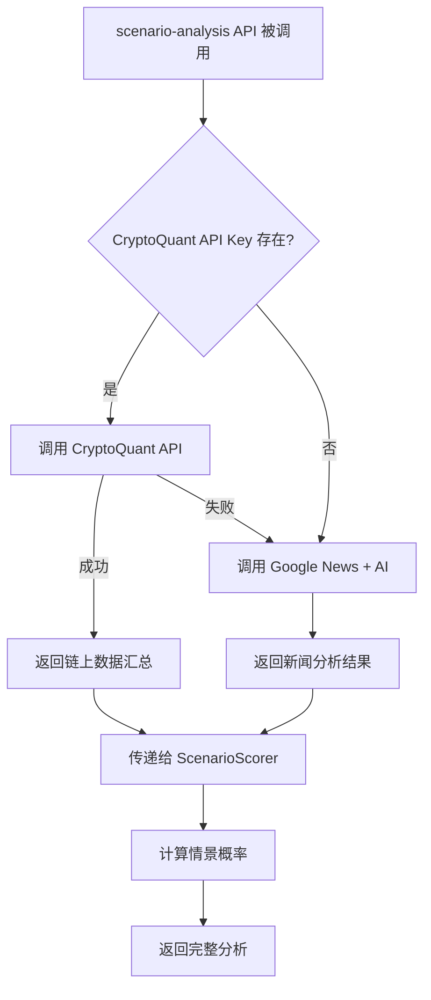

# CryptoQuant 链上数据集成文档

## ✅ 已完成的工作

### 1. **CryptoQuant API 封装** (`cryptoquant_api.py`)
- ✅ 完整的 API 封装类 `CryptoQuantAPI`
- ✅ 交易所储备数据获取 `get_exchange_reserve()`
- ✅ 长期持有者供应量获取 `get_long_term_holder_supply()`
- ✅ 持有者行为中文汇总 `get_holder_behavior_summary()`
- ✅ 错误处理和友好提示

### 2. **辅助函数模块** (`holder_behavior_helper.py`)
- ✅ 简化接口 `get_holder_behavior_summary()`
- ✅ **自动降级机制**: CryptoQuant 失败 → Google News + AI 分析
- ✅ 确保系统始终能返回有用的数据

### 3. **集成到主 API** (`main.py`)
- ✅ `/api/scenario-analysis` 接口使用链上真实数据
- ✅ 替换了原来的新闻分析方式
- ✅ 完整的错误处理和日志输出

---

## 📦 数据源说明

### CryptoQuant API 提供的数据

| 指标 | 含义 | 交易信号 |
|------|------|----------|
| **交易所储备** | 交易所内的 BTC 余额 | 余额↓ = 提币到冷钱包 (看涨)<br/>余额↑ = 准备抛售 (看跌) |
| **长期持有者供应** | 持有超过 155 天的 BTC | 供应↑ = 长期积累 (看涨)<br/>供应↓ = 长期持有者套现 (看跌) |

### 输出示例

```
30天净流出 4.5万枚；持续提币，停止抛售
```

---

## 🚀 使用方法

### 方法 1: 获取 CryptoQuant API Key (推荐)

1. **注册账号**: https://cryptoquant.com/
2. **获取 API Key**: https://cryptoquant.com/docs/api
   - 免费账户: 每天 10 次请求
   - Pro 账户: 更高限额
3. **配置环境变量**:
   ```bash
   # 编辑 .env 文件
   echo "CRYPTOQUANT_API_KEY=your_key_here" >> .env
   ```

### 方法 2: 不设置 API Key (自动降级)

如果不设置 `CRYPTOQUANT_API_KEY`，系统会自动使用 **Google News + AI 分析** 作为备用方案。

---

## 🧪 测试

### 测试 1: 单独测试 CryptoQuant API

```bash
cd /Users/user/tradingAssistant/tradingAssistant/backend
python3 cryptoquant_api.py
```

**有 API Key 的输出:**
```
✓ API Key 已配置: ABC1234567...

【持有者行为汇总】
  30天净流出 4.5万枚；持续提币，停止抛售

【交易所余额 (最近 7 天)】
   datetime         value
0  2024-12-24  1850234.5
1  2024-12-25  1848123.2
...
```

**无 API Key 的输出:**
```
⚠️ 警告: 未找到 CRYPTOQUANT_API_KEY
   请在 .env 文件中添加: CRYPTOQUANT_API_KEY=your_key_here
```

---

### 测试 2: 测试辅助函数（带降级）

```bash
python3 holder_behavior_helper.py
```

**输出示例:**
```
【持有者行为汇总测试】
结果: 30天净流出 4.5万枚；持续提币，停止抛售
```

如果 CryptoQuant 失败，会自动切换到新闻分析：
```
⚠️ CryptoQuant 获取失败，使用备用方案: API Key 未设置，无法进行请求
结果: 长期持有者持续积累，近期未见大规模抛售
```

---

### 测试 3: 完整集成测试

```bash
python3 test_cryptoquant_integration.py
```

这会测试：
1. ✅ API Key 配置状态
2. ✅ CryptoQuant 直接调用
3. ✅ 自动降级机制
4. ✅ 系统集成状态

---

## 💡 API 端点参考

### CryptoQuant API 常用端点

根据您提供的代码模板，以下是常用端点：

```python
# 基础 URL
BASE_URL = "https://api.cryptoquant.com/v1"

# 示例端点
"/btc/exchange-flows/reserve"           # 交易所储备
"/btc/market-indicator/lth-supply"      # 长期持有者供应
"/btc/market-indicator/sopr"            # SOPR 指标
"/btc/network-indicator/difficulty"     # 挖矿难度
```

**注意**: 实际端点可能因 CryptoQuant API 版本而异，请参考官方文档：
https://docs.cryptoquant.com/docs/api-guide

---

## 🔧 故障排除

### 问题 1: `ValueError: API Key 未设置`

**原因**: `.env` 文件中没有 `CRYPTOQUANT_API_KEY`

**解决方案**:
```bash
# 编辑 .env 文件
nano /Users/user/tradingAssistant/tradingAssistant/backend/.env

# 添加一行
CRYPTOQUANT_API_KEY=your_actual_key_here
```

### 问题 2: `HTTP 401 Unauthorized`

**原因**: API Key 无效或过期

**解决方案**:
1. 登录 CryptoQuant
2. 重新生成 API Key
3. 更新 `.env` 文件

### 问题 3: `HTTP 429 Too Many Requests`

**原因**: 超过免费限额（10次/天）

**解决方案**:
- 等待 24 小时后重试
- 或升级到 Pro 账户

### 问题 4: 数据格式错误

**原因**: CryptoQuant API 返回的数据结构变化

**解决方案**:
检查 `cryptoquant_api.py` 中的列名映射，可能需要更新：
```python
# 在 get_holder_behavior_summary() 中
value_col = None
for col in ['value', 'reserve', 'balance', 'amount']:  # 添加新列名
    if col in df_reserve.columns:
        value_col = col
        break
```

---

## 📊 在 main.py 中的使用流程



---

## 🎯 下一步优化建议

### 1. 缓存机制
避免频繁调用 API（节省配额）：
```python
import time

cache = {"data": None, "timestamp": 0}

def get_cached_data(ttl=3600):  # 1小时缓存
    if time.time() - cache["timestamp"] < ttl:
        return cache["data"]
    
    cache["data"] = api.get_holder_behavior_summary()
    cache["timestamp"] = time.time()
    return cache["data"]
```

### 2. 数据库存储
将历史数据存入 SQLite，用于回测和趋势分析：
```bash
pip install sqlite3
```

### 3. 更多指标
CryptoQuant 提供的其他有用指标：
- **SOPR** (Spent Output Profit Ratio): 判断盈利/亏损卖出
- **MVRV** (Market Value to Realized Value): 估值高低
- **Funding Rate**: 永续合约资金费率

### 4. 定时任务
使用 `cron` 或 `apscheduler` 定时更新数据：
```bash
# crontab -e
0 */6 * * * cd /path/to/backend && python3 cryptoquant_api.py
```

---

## 📁 文件结构

```
tradingAssistant/backend/
├── cryptoquant_api.py              # CryptoQuant API 封装
├── holder_behavior_helper.py       # 带降级的辅助函数
├── btc_etf_scraper.py             # ETF 数据爬虫
├── btc_etf_flow_helper.py         # ETF 辅助函数
├── scenario_scoring.py            # 情景评分系统
├── main.py                        # FastAPI 主程序 (已集成)
├── test_cryptoquant_integration.py # 测试脚本
├── BTC_ETF_README.md              # ETF 文档
└── CRYPTOQUANT_README.md          # 本文档
```

---

## ✅ 总结

您现在拥有一个**完整的链上数据获取系统**：

| 功能 | 数据源 | 备用方案 |
|------|--------|----------|
| **BTC ETF 流向** | Farside Investors (爬虫) | News + AI |
| **持有者行为** | CryptoQuant API (链上) | News + AI |
| **Fed 政策** | News + AI | - |
| **美股表现** | News + AI | - |

**优势**:
- ✅ **真实数据优先**: 优先使用官方 API 和链上数据
- ✅ **容错机制**: 自动降级到备用方案
- ✅ **零配置可用**: 不设置 API Key 也能运行
- ✅ **易于升级**: 设置 API Key 后自动使用高质量数据

**立即开始使用！** 🚀

```bash
# 启动服务器
uvicorn main:app --reload --port 8000

# 测试接口
curl -X POST http://localhost:8000/api/scenario-analysis \
  -H 'Content-Type: application/json' \
  -d '{"symbol": "BTC/USDT"}'
```
